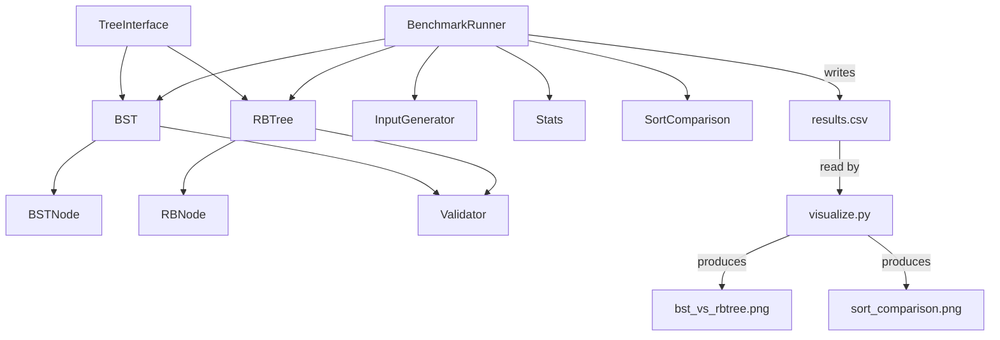

# RBTrees & BSTs Benchmarking — Project Documentation

## Overview

This is a **Java Maven** project (Assignment 2, DSA course) that implements two self-contained tree data structures — a **Binary Search Tree (BST)** and a **Red-Black Tree (RBTree)** — and rigorously benchmarks their performance against each other and against **MergeSort** across multiple input distributions and four core operations.

The project uses **Java 21**, **JUnit 5** for testing, **SLF4J + Logback** for structured debug logging, and a **Python** script ([visualize.py](file:///home/eyad-amr/Desktop/Assignement%202%20%28DSA%29/RBTrees_BSTs_Benchmarking/visualize.py)) to generate bar-chart reports from the CSV benchmark output.

---

## Project Structure

```
RBTrees_BSTs_Benchmarking/
├── pom.xml                         # Maven build configuration
├── results.csv                     # Benchmark results (generated at runtime)
├── visualize.py                    # Python script to visualize results
├── bst_vs_rbtree.png               # Generated chart (BST vs RBTree per operation)
├── sort_comparison.png             # Generated chart (BST vs RBTree vs MergeSort sort)
└── src/
    ├── main/java/trees/
    │   ├── TreeInterface.java       # Common interface for both trees
    │   ├── BST.java                 # Binary Search Tree implementation
    │   ├── RBTree.java              # Red-Black Tree implementation
    │   ├── Validator.java           # Assertion-based structural validators
    │   ├── Main.java                # Sanity-test entry point (manual smoke test)
    │   └── Node/
    │       ├── BSTNode.java         # Node class for BST
    │       └── RBNode.java          # Node class for RBTree
    └── main/java/trees/benchmark/
    │   ├── BenchmarkRunner.java     # Main benchmarking entry point
    │   ├── InputGenerator.java      # Generates test input arrays
    │   ├── Stats.java               # Computes mean, median, std dev
    │   └── SortComparison.java      # MergeSort implementation for comparison
    └── test/java/trees/
        ├── BSTTest.java             # JUnit 5 tests for BST
        └── RBTreeTest.java          # JUnit 5 tests for RBTree
```

---

## Architecture



Both [BST](file:///home/eyad-amr/Desktop/Assignement%202%20%28DSA%29/RBTrees_BSTs_Benchmarking/src/main/java/trees/BST.java#9-168) and [RBTree](file:///home/eyad-amr/Desktop/Assignement%202%20%28DSA%29/RBTrees_BSTs_Benchmarking/src/main/java/trees/RBTree.java#11-387) implement the same [TreeInterface](file:///home/eyad-amr/Desktop/Assignement%202%20%28DSA%29/RBTrees_BSTs_Benchmarking/src/main/java/trees/TreeInterface.java#3-12), making them interchangeable in the benchmarking harness via Java's `Supplier<TreeInterface>` factory pattern.

---

## Class Reference

### [TreeInterface](file:///home/eyad-amr/Desktop/Assignement%202%20%28DSA%29/RBTrees_BSTs_Benchmarking/src/main/java/trees/TreeInterface.java#3-12) — [trees/TreeInterface.java](file:///home/eyad-amr/Desktop/Assignement%202%20%28DSA%29/RBTrees_BSTs_Benchmarking/src/main/java/trees/TreeInterface.java)

The common contract that both tree implementations must satisfy.

| Method | Description |
|---|---|
| `boolean insert(int v)` | Insert a value; returns `false` if duplicate |
| `boolean delete(int v)` | Delete a value; returns `false` if not found |
| `boolean contains(int v)` | Search for a value |
| `int[] inOrder()` | Return all elements in sorted order |
| `int height()` | Return the height of the tree |
| `int size()` | Return the number of elements |

---

### [BSTNode](file:///home/eyad-amr/Desktop/Assignement%202%20%28DSA%29/RBTrees_BSTs_Benchmarking/src/main/java/trees/Node/BSTNode.java#3-12) — [trees/Node/BSTNode.java](file:///home/eyad-amr/Desktop/Assignement%202%20%28DSA%29/RBTrees_BSTs_Benchmarking/src/main/java/trees/Node/BSTNode.java)

Plain node class for the BST. Stores an integer `data` and references to `left` and `right` children. No parent pointer.

```
BSTNode
├── int data
├── BSTNode left
└── BSTNode right
```

---

### [RBNode](file:///home/eyad-amr/Desktop/Assignement%202%20%28DSA%29/RBTrees_BSTs_Benchmarking/src/main/java/trees/Node/RBNode.java#3-16) — [trees/Node/RBNode.java](file:///home/eyad-amr/Desktop/Assignement%202%20%28DSA%29/RBTrees_BSTs_Benchmarking/src/main/java/trees/Node/RBNode.java)

Node class for the Red-Black Tree. Stores `data`, child pointers, a **parent pointer** (required for rotations and fixup), and a `boolean isRed` color flag. New nodes always default to red (`isRed = true`).

```
RBNode
├── int data
├── boolean isRed  (default: true)
├── RBNode left
├── RBNode right
└── RBNode parent
```

---

### [BST](file:///home/eyad-amr/Desktop/Assignement%202%20%28DSA%29/RBTrees_BSTs_Benchmarking/src/main/java/trees/BST.java#9-168) — [trees/BST.java](file:///home/eyad-amr/Desktop/Assignement%202%20%28DSA%29/RBTrees_BSTs_Benchmarking/src/main/java/trees/BST.java)

A standard, unbalanced **Binary Search Tree** implementing [TreeInterface](file:///home/eyad-amr/Desktop/Assignement%202%20%28DSA%29/RBTrees_BSTs_Benchmarking/src/main/java/trees/TreeInterface.java#3-12). Uses SLF4J for debug-level logging at every decision point.

#### Fields
| Field | Type | Description |
|---|---|---|
| [root](file:///home/eyad-amr/Desktop/Assignement%202%20%28DSA%29/RBTrees_BSTs_Benchmarking/src/main/java/trees/Validator.java#48-52) | [BSTNode](file:///home/eyad-amr/Desktop/Assignement%202%20%28DSA%29/RBTrees_BSTs_Benchmarking/src/main/java/trees/Node/BSTNode.java#3-12) | Root of the tree |
| [size](file:///home/eyad-amr/Desktop/Assignement%202%20%28DSA%29/RBTrees_BSTs_Benchmarking/src/main/java/trees/TreeInterface.java#9-10) | [int](file:///home/eyad-amr/Desktop/Assignement%202%20%28DSA%29/RBTrees_BSTs_Benchmarking/src/main/java/trees/benchmark/BenchmarkRunner.java#145-151) | Tracks the element count |
| `logger` | `Logger` | SLF4J logger |

#### Key Methods

**[insert(int v)](file:///home/eyad-amr/Desktop/Assignement%202%20%28DSA%29/RBTrees_BSTs_Benchmarking/src/main/java/trees/BST.java#85-98)**  
Calls [contains()](file:///home/eyad-amr/Desktop/Assignement%202%20%28DSA%29/RBTrees_BSTs_Benchmarking/src/main/java/trees/TreeInterface.java#6-7) first to reject duplicates. Delegates to a private recursive [insertHelper](file:///home/eyad-amr/Desktop/Assignement%202%20%28DSA%29/RBTrees_BSTs_Benchmarking/src/main/java/trees/BST.java#99-114) that traverses left/right based on value comparison and attaches a new [BSTNode](file:///home/eyad-amr/Desktop/Assignement%202%20%28DSA%29/RBTrees_BSTs_Benchmarking/src/main/java/trees/Node/BSTNode.java#3-12) at the `null` position. After insertion, optionally calls `Validator.checkBST(this)` if validation mode is on.

**[delete(int v)](file:///home/eyad-amr/Desktop/Assignement%202%20%28DSA%29/RBTrees_BSTs_Benchmarking/src/main/java/trees/TreeInterface.java#5-6)**  
Calls [contains()](file:///home/eyad-amr/Desktop/Assignement%202%20%28DSA%29/RBTrees_BSTs_Benchmarking/src/main/java/trees/TreeInterface.java#6-7) first to confirm existence. Delegates to [deleteHelper](file:///home/eyad-amr/Desktop/Assignement%202%20%28DSA%29/RBTrees_BSTs_Benchmarking/src/main/java/trees/BST.java#129-150) which handles three cases:
- **Leaf node** → set to `null`
- **Has right child** → replace with in-order **successor** (leftmost node in right subtree)
- **Has only left child** → replace with in-order **predecessor** (rightmost node in left subtree)

**[contains(int v)](file:///home/eyad-amr/Desktop/Assignement%202%20%28DSA%29/RBTrees_BSTs_Benchmarking/src/main/java/trees/TreeInterface.java#6-7)**  
Standard recursive BST search: go left if `v < node.data`, right if `v > node.data`, return `true` on match.

**[inOrder()](file:///home/eyad-amr/Desktop/Assignement%202%20%28DSA%29/RBTrees_BSTs_Benchmarking/src/main/java/trees/BST.java#67-76)**  
Recursive in-order traversal (left → current → right) collecting values into an `ArrayList`, then copying to `int[]`.

**[height()](file:///home/eyad-amr/Desktop/Assignement%202%20%28DSA%29/RBTrees_BSTs_Benchmarking/src/main/java/trees/RBTree.java#30-35)**  
Recursive: `1 + max(leftHeight, rightHeight)`, base case returns `0` for `null`.

> [!NOTE]
> On a sorted input, the BST degenerates into a linked list with height = N. This is demonstrated explicitly by [heightOnSortedInput](file:///home/eyad-amr/Desktop/Assignement%202%20%28DSA%29/RBTrees_BSTs_Benchmarking/src/test/java/trees/RBTreeTest.java#266-281) test and the benchmark results.

---

### [RBTree](file:///home/eyad-amr/Desktop/Assignement%202%20%28DSA%29/RBTrees_BSTs_Benchmarking/src/main/java/trees/RBTree.java#11-387) — [trees/RBTree.java](file:///home/eyad-amr/Desktop/Assignement%202%20%28DSA%29/RBTrees_BSTs_Benchmarking/src/main/java/trees/RBTree.java)

A **Red-Black Tree** — a self-balancing BST that maintains O(log N) height guarantees by enforcing four invariants:
1. Every node is Red or Black.
2. The root is always Black.
3. No two consecutive Red nodes on any path (Red parent → Red child is forbidden).
4. Every path from root to a NIL leaf has the same number of Black nodes (**black-height**).

#### Special Design: Sentinel NIL Node
Instead of using `null` for empty leaves, the tree uses a single shared **sentinel** [NIL](file:///home/eyad-amr/Desktop/Assignement%202%20%28DSA%29/RBTrees_BSTs_Benchmarking/src/main/java/trees/RBTree.java#383-386) node. Every leaf and the root's parent point to this [NIL](file:///home/eyad-amr/Desktop/Assignement%202%20%28DSA%29/RBTrees_BSTs_Benchmarking/src/main/java/trees/RBTree.java#383-386). The [NIL](file:///home/eyad-amr/Desktop/Assignement%202%20%28DSA%29/RBTrees_BSTs_Benchmarking/src/main/java/trees/RBTree.java#383-386) node is always Black (`isRed = false`). This simplifies boundary checks in all algorithms.

```java
// constructor
this.NIL = new RBNode(0);
NIL.left = NIL.right = NIL.parent = NIL;
NIL.isRed = false;
root = NIL;
```

#### Fields
| Field | Type | Description |
|---|---|---|
| [root](file:///home/eyad-amr/Desktop/Assignement%202%20%28DSA%29/RBTrees_BSTs_Benchmarking/src/main/java/trees/Validator.java#48-52) | [RBNode](file:///home/eyad-amr/Desktop/Assignement%202%20%28DSA%29/RBTrees_BSTs_Benchmarking/src/main/java/trees/Node/RBNode.java#3-16) | Root of the tree |
| [NIL](file:///home/eyad-amr/Desktop/Assignement%202%20%28DSA%29/RBTrees_BSTs_Benchmarking/src/main/java/trees/RBTree.java#383-386) | [RBNode](file:///home/eyad-amr/Desktop/Assignement%202%20%28DSA%29/RBTrees_BSTs_Benchmarking/src/main/java/trees/Node/RBNode.java#3-16) | Shared sentinel node (black leaf) |
| [size](file:///home/eyad-amr/Desktop/Assignement%202%20%28DSA%29/RBTrees_BSTs_Benchmarking/src/main/java/trees/TreeInterface.java#9-10) | [int](file:///home/eyad-amr/Desktop/Assignement%202%20%28DSA%29/RBTrees_BSTs_Benchmarking/src/main/java/trees/benchmark/BenchmarkRunner.java#145-151) | Element count |
| `logger` | `Logger` | SLF4J logger |

#### Insertion — [insert(int v)](file:///home/eyad-amr/Desktop/Assignement%202%20%28DSA%29/RBTrees_BSTs_Benchmarking/src/main/java/trees/BST.java#85-98) / [InsertHelper](file:///home/eyad-amr/Desktop/Assignement%202%20%28DSA%29/RBTrees_BSTs_Benchmarking/src/main/java/trees/RBTree.java#103-132) / [insertFixup](file:///home/eyad-amr/Desktop/Assignement%202%20%28DSA%29/RBTrees_BSTs_Benchmarking/src/main/java/trees/RBTree.java#133-198)

1. Standard BST insertion: walk the tree until reaching [NIL](file:///home/eyad-amr/Desktop/Assignement%202%20%28DSA%29/RBTrees_BSTs_Benchmarking/src/main/java/trees/RBTree.java#383-386), attach the new node (colored **Red**).
2. Set parent pointer correctly.
3. Call [insertFixup(z)](file:///home/eyad-amr/Desktop/Assignement%202%20%28DSA%29/RBTrees_BSTs_Benchmarking/src/main/java/trees/RBTree.java#133-198) to restore Red-Black properties.

**[insertFixup](file:///home/eyad-amr/Desktop/Assignement%202%20%28DSA%29/RBTrees_BSTs_Benchmarking/src/main/java/trees/RBTree.java#133-198) — Three Cases (mirrored for left/right)**

| Case | Condition | Action |
|---|---|---|
| Case 1 | Uncle is Red | Recolor parent, uncle → Black; grandparent → Red. Move `z` up to grandparent. |
| Case 2 | Uncle is Black, `z` is an inner child | Rotate parent in opposite direction to convert to Case 3. |
| Case 3 | Uncle is Black, `z` is an outer child | Recolor parent → Black, grandparent → Red. Rotate grandparent. |

After the loop, the root is always forced to Black: `root.isRed = false`.

#### Deletion — [delete(int v)](file:///home/eyad-amr/Desktop/Assignement%202%20%28DSA%29/RBTrees_BSTs_Benchmarking/src/main/java/trees/TreeInterface.java#5-6) / [deleteNode](file:///home/eyad-amr/Desktop/Assignement%202%20%28DSA%29/RBTrees_BSTs_Benchmarking/src/main/java/trees/RBTree.java#227-261) / [fixDelete](file:///home/eyad-amr/Desktop/Assignement%202%20%28DSA%29/RBTrees_BSTs_Benchmarking/src/main/java/trees/RBTree.java#262-333)

1. [findNode](file:///home/eyad-amr/Desktop/Assignement%202%20%28DSA%29/RBTrees_BSTs_Benchmarking/src/main/java/trees/RBTree.java#216-226) locates the node iteratively.
2. [deleteNode](file:///home/eyad-amr/Desktop/Assignement%202%20%28DSA%29/RBTrees_BSTs_Benchmarking/src/main/java/trees/RBTree.java#227-261) handles three structural cases:
   - Node has **no left child** → transplant right child in.
   - Node has **no right child** → transplant left child in.
   - Node has **two children** → find in-order successor `y`, transplant `y`'s right child in `y`'s old position, then transplant `y` into the deleted node's position, copying color.
3. If the removed node (or its successor) was **Black**, call [fixDelete(x)](file:///home/eyad-amr/Desktop/Assignement%202%20%28DSA%29/RBTrees_BSTs_Benchmarking/src/main/java/trees/RBTree.java#262-333) to restore the black-height invariant.

**[fixDelete](file:///home/eyad-amr/Desktop/Assignement%202%20%28DSA%29/RBTrees_BSTs_Benchmarking/src/main/java/trees/RBTree.java#262-333) — Four Cases (mirrored for left/right)**

| Case | Condition | Action |
|---|---|---|
| Case 1 | Sibling `w` is Red | Recolor `w` → Black, parent → Red; rotate parent. Update `w`. |
| Case 2 | Both of `w`'s children are Black | Recolor `w` → Red; move `x` up. |
| Case 3 | `w`'s far child is Black | Recolor `w`'s near child → Black, `w` → Red; rotate `w`. Update `w`. |
| Case 4 | `w`'s far child is Red | Set `w`'s color to parent's color; parent → Black; far child → Black; rotate parent. Done. |

#### Rotations

**[rotateLeft(x)](file:///home/eyad-amr/Desktop/Assignement%202%20%28DSA%29/RBTrees_BSTs_Benchmarking/src/main/java/trees/RBTree.java#351-364)**: Promotes `x.right` (call it `y`) to `x`'s position; `y.left` becomes `x.right`; `x` becomes `y.left`.

**[rotateRight(y)](file:///home/eyad-amr/Desktop/Assignement%202%20%28DSA%29/RBTrees_BSTs_Benchmarking/src/main/java/trees/RBTree.java#365-378)**: Promotes `y.left` (call it `x`) to `y`'s position; `x.right` becomes `y.left`; `y` becomes `x.right`.

Both correctly update all parent pointers.

---

### [Validator](file:///home/eyad-amr/Desktop/Assignement%202%20%28DSA%29/RBTrees_BSTs_Benchmarking/src/main/java/trees/Validator.java#8-108) — [trees/Validator.java](file:///home/eyad-amr/Desktop/Assignement%202%20%28DSA%29/RBTrees_BSTs_Benchmarking/src/main/java/trees/Validator.java)

A **disabled-by-default** assertion utility (`validate = false`). When enabled during development, it validates tree correctness after every mutation.

**BST Checks ([checkBST](file:///home/eyad-amr/Desktop/Assignement%202%20%28DSA%29/RBTrees_BSTs_Benchmarking/src/main/java/trees/Validator.java#12-19))**:
- [isOrdered](file:///home/eyad-amr/Desktop/Assignement%202%20%28DSA%29/RBTrees_BSTs_Benchmarking/src/main/java/trees/Validator.java#29-38) — Recursive check that every node's value is within its valid `[min, max]` range.
- [sizeConsistency](file:///home/eyad-amr/Desktop/Assignement%202%20%28DSA%29/RBTrees_BSTs_Benchmarking/src/main/java/trees/Validator.java#53-58) — Counts nodes by traversal and compares to `tree.size()`.
- [noCycles](file:///home/eyad-amr/Desktop/Assignement%202%20%28DSA%29/RBTrees_BSTs_Benchmarking/src/main/java/trees/Validator.java#80-87) — Traverses using a `HashSet<BSTNode>` to detect any repeated node reference.

**RBTree Checks ([checkRBTree](file:///home/eyad-amr/Desktop/Assignement%202%20%28DSA%29/RBTrees_BSTs_Benchmarking/src/main/java/trees/Validator.java#20-28))**:
- [isOrdered](file:///home/eyad-amr/Desktop/Assignement%202%20%28DSA%29/RBTrees_BSTs_Benchmarking/src/main/java/trees/Validator.java#29-38) — Same range check adapted for the [NIL](file:///home/eyad-amr/Desktop/Assignement%202%20%28DSA%29/RBTrees_BSTs_Benchmarking/src/main/java/trees/RBTree.java#383-386) sentinel.
- [rootIsBlack](file:///home/eyad-amr/Desktop/Assignement%202%20%28DSA%29/RBTrees_BSTs_Benchmarking/src/main/java/trees/Validator.java#48-52) — Verifies `!root.isRed`.
- [sizeConsistency](file:///home/eyad-amr/Desktop/Assignement%202%20%28DSA%29/RBTrees_BSTs_Benchmarking/src/main/java/trees/Validator.java#53-58) — Same as BST version, using NIL as the stop condition.
- [noConsecutiveReds](file:///home/eyad-amr/Desktop/Assignement%202%20%28DSA%29/RBTrees_BSTs_Benchmarking/src/main/java/trees/Validator.java#88-97) — Verifies no Red node has a Red child.
- [blackHeight](file:///home/eyad-amr/Desktop/Assignement%202%20%28DSA%29/RBTrees_BSTs_Benchmarking/src/main/java/trees/Validator.java#98-107) — Recursively verifies equal black-height on all paths; returns `-1` on violation.

> [!IMPORTANT]
> `Validator.validate` is set to `false` at all times in the committed code. Enabling it would add significant overhead to every insert/delete call, and it requires Java's `-ea` (enable assertions) JVM flag to activate the `assert` statements.

---

### [Main](file:///home/eyad-amr/Desktop/Assignement%202%20%28DSA%29/RBTrees_BSTs_Benchmarking/src/main/java/trees/Main.java#5-50) — [trees/Main.java](file:///home/eyad-amr/Desktop/Assignement%202%20%28DSA%29/RBTrees_BSTs_Benchmarking/src/main/java/trees/Main.java)

A lightweight smoke-test entry point (not the benchmark entry point). Creates a BST and an RBTree, inserts `{5, 3, 7, 1, 4}`, then verifies size, height, contains, inOrder, and a delete operation — printing expected vs. actual values to stdout.

---

## Benchmark System

### [BenchmarkRunner](file:///home/eyad-amr/Desktop/Assignement%202%20%28DSA%29/RBTrees_BSTs_Benchmarking/src/main/java/trees/benchmark/BenchmarkRunner.java#14-211) — [trees/benchmark/BenchmarkRunner.java](file:///home/eyad-amr/Desktop/Assignement%202%20%28DSA%29/RBTrees_BSTs_Benchmarking/src/main/java/trees/benchmark/BenchmarkRunner.java)

The **main entry point** for the application (`trees.benchmark.BenchmarkRunner` is set as the JAR manifest main class). Orchestrates all benchmarks and produces [results.csv](file:///home/eyad-amr/Desktop/Assignement%202%20%28DSA%29/RBTrees_BSTs_Benchmarking/results.csv).

#### Configuration
- `RUNS = 5` — Each benchmark is repeated 5 times to get stable statistics.

#### Input Distributions
Four input arrays of **N = 100,000** integers are generated:
| Distribution | Description |
|---|---|
| `RANDOM` | Uniformly random integers in `[0, 1,000,000]` |
| `Nearly-Sorted (1%)` | `[0..N-1]` with 1% random pair-swaps |
| `Nearly-Sorted (5%)` | Same, with 5% swaps |
| `Nearly-Sorted (10%)` | Same, with 10% swaps |

#### Benchmarked Operations

| Method | What It Measures |
|---|---|
| [benchmarkInsert](file:///home/eyad-amr/Desktop/Assignement%202%20%28DSA%29/RBTrees_BSTs_Benchmarking/src/main/java/trees/benchmark/BenchmarkRunner.java#37-56) | Time to insert all N elements into a fresh tree (5 runs, fresh tree each run) |
| [benchmarkContains](file:///home/eyad-amr/Desktop/Assignement%202%20%28DSA%29/RBTrees_BSTs_Benchmarking/src/main/java/trees/benchmark/BenchmarkRunner.java#57-87) | Time for 100,000 lookups: 50k hits (existing keys) + 50k misses (out-of-range keys), on a pre-filled tree |
| [benchmarkDelete](file:///home/eyad-amr/Desktop/Assignement%202%20%28DSA%29/RBTrees_BSTs_Benchmarking/src/main/java/trees/benchmark/BenchmarkRunner.java#88-111) | Time to delete 20% of elements (random selection), on a pre-filled tree (5 runs, fresh tree each run) |
| [benchmarkSort](file:///home/eyad-amr/Desktop/Assignement%202%20%28DSA%29/RBTrees_BSTs_Benchmarking/src/main/java/trees/benchmark/BenchmarkRunner.java#112-128) | Time to insert all N elements and then call [inOrder()](file:///home/eyad-amr/Desktop/Assignement%202%20%28DSA%29/RBTrees_BSTs_Benchmarking/src/main/java/trees/BST.java#67-76) — effectively tree sort |
| [benchmarkMergeSort](file:///home/eyad-amr/Desktop/Assignement%202%20%28DSA%29/RBTrees_BSTs_Benchmarking/src/main/java/trees/benchmark/BenchmarkRunner.java#129-144) | Time to sort a copy of the input array using `SortComparison.sort()` |

#### Timing

All timing uses `System.nanoTime()` (wall-clock nanoseconds). Results are converted to milliseconds for display and CSV output.

#### Output

- Console: `Mean | Median | StdDev` per operation + speedup ratios (BST time / RBTree time).
- File: [results.csv](file:///home/eyad-amr/Desktop/Assignement%202%20%28DSA%29/RBTrees_BSTs_Benchmarking/results.csv) — one row per [(distribution, structure, operation)](file:///home/eyad-amr/Desktop/Assignement%202%20%28DSA%29/RBTrees_BSTs_Benchmarking/src/main/java/trees/BST.java#9-168) combination.

---

### [InputGenerator](file:///home/eyad-amr/Desktop/Assignement%202%20%28DSA%29/RBTrees_BSTs_Benchmarking/src/main/java/trees/benchmark/InputGenerator.java#7-51) — [trees/benchmark/InputGenerator.java](file:///home/eyad-amr/Desktop/Assignement%202%20%28DSA%29/RBTrees_BSTs_Benchmarking/src/main/java/trees/benchmark/InputGenerator.java)

Generates reproducible input arrays. Uses a fixed seed (`seed = 40`) so results are deterministic across runs.

| Method | Description |
|---|---|
| [generateRandom()](file:///home/eyad-amr/Desktop/Assignement%202%20%28DSA%29/RBTrees_BSTs_Benchmarking/src/main/java/trees/benchmark/InputGenerator.java#12-22) | `N` random integers in `[0, 10*N]` using [Random(seed)](file:///home/eyad-amr/Desktop/Assignement%202%20%28DSA%29/RBTrees_BSTs_Benchmarking/src/main/java/trees/benchmark/InputGenerator.java#12-22) |
| [generateNearlySorted(swapPercent)](file:///home/eyad-amr/Desktop/Assignement%202%20%28DSA%29/RBTrees_BSTs_Benchmarking/src/main/java/trees/benchmark/InputGenerator.java#24-42) | `[0..N-1]` array, randomly swaps [(swapPercent/100) * N](file:///home/eyad-amr/Desktop/Assignement%202%20%28DSA%29/RBTrees_BSTs_Benchmarking/src/main/java/trees/BST.java#9-168) pairs |

> [!NOTE]
> [InputGenerator](file:///home/eyad-amr/Desktop/Assignement%202%20%28DSA%29/RBTrees_BSTs_Benchmarking/src/main/java/trees/benchmark/InputGenerator.java#7-51) has two [swap](file:///home/eyad-amr/Desktop/Assignement%202%20%28DSA%29/RBTrees_BSTs_Benchmarking/src/main/java/trees/benchmark/InputGenerator.java#43-49) methods — the private [swap(int[], i, j)](file:///home/eyad-amr/Desktop/Assignement%202%20%28DSA%29/RBTrees_BSTs_Benchmarking/src/main/java/trees/benchmark/InputGenerator.java#43-49) is the one actually called internally. The `import static java.util.Collections.swap` at the top is unused (and would fail on `int[]` anyway since `Collections.swap` works only on `List`).

---

### [Stats](file:///home/eyad-amr/Desktop/Assignement%202%20%28DSA%29/RBTrees_BSTs_Benchmarking/src/main/java/trees/benchmark/Stats.java#6-43) — [trees/benchmark/Stats.java](file:///home/eyad-amr/Desktop/Assignement%202%20%28DSA%29/RBTrees_BSTs_Benchmarking/src/main/java/trees/benchmark/Stats.java)

Stateless utility class with three static methods over `long[]` arrays of nanosecond timings.

| Method | Formula |
|---|---|
| [mean(times)](file:///home/eyad-amr/Desktop/Assignement%202%20%28DSA%29/RBTrees_BSTs_Benchmarking/src/main/java/trees/benchmark/Stats.java#7-15) | `sum / N` |
| [median(times)](file:///home/eyad-amr/Desktop/Assignement%202%20%28DSA%29/RBTrees_BSTs_Benchmarking/src/main/java/trees/benchmark/Stats.java#16-30) | Sort copy; middle element (or average of two middle for even N) |
| [standardDeviation(times)](file:///home/eyad-amr/Desktop/Assignement%202%20%28DSA%29/RBTrees_BSTs_Benchmarking/src/main/java/trees/benchmark/Stats.java#31-42) | Population std dev: `sqrt(sum((x - mean)²) / N)` |

---

### [SortComparison](file:///home/eyad-amr/Desktop/Assignement%202%20%28DSA%29/RBTrees_BSTs_Benchmarking/src/main/java/trees/benchmark/SortComparison.java#6-96) — [trees/benchmark/SortComparison.java](file:///home/eyad-amr/Desktop/Assignement%202%20%28DSA%29/RBTrees_BSTs_Benchmarking/src/main/java/trees/benchmark/SortComparison.java)

Implements **MergeSort** in-place (on `int[]`) as a comparison baseline for the tree-sort benchmark.

Internally tracks `comparisons` and `interchanges` counters (though these are not used by the benchmarking output — only timing is captured). Contains an inner [SortStep](file:///home/eyad-amr/Desktop/Assignement%202%20%28DSA%29/RBTrees_BSTs_Benchmarking/src/main/java/trees/benchmark/SortComparison.java#7-16) class (with array snapshot + active index) — also unused by the benchmark, likely a leftover from a visualization feature.

**Algorithm**: standard top-down recursive merge sort.
- [mergeSort(array)](file:///home/eyad-amr/Desktop/Assignement%202%20%28DSA%29/RBTrees_BSTs_Benchmarking/src/main/java/trees/benchmark/SortComparison.java#37-59) — splits into left/right halves, recurses, then merges.
- [merge(array, left, right)](file:///home/eyad-amr/Desktop/Assignement%202%20%28DSA%29/RBTrees_BSTs_Benchmarking/src/main/java/trees/benchmark/SortComparison.java#60-95) — standard two-pointer merge back into `array`.

---

## Unit Tests

### [BSTTest](file:///home/eyad-amr/Desktop/Assignement%202%20%28DSA%29/RBTrees_BSTs_Benchmarking/src/test/java/trees/BSTTest.java#8-284) — 22 test cases

Tests use `@BeforeEach` to create a fresh [BST](file:///home/eyad-amr/Desktop/Assignement%202%20%28DSA%29/RBTrees_BSTs_Benchmarking/src/main/java/trees/BST.java#9-168) before every test.

| Category | Tests |
|---|---|
| **Insert** | [singleInsert](file:///home/eyad-amr/Desktop/Assignement%202%20%28DSA%29/RBTrees_BSTs_Benchmarking/src/test/java/trees/BSTTest.java#18-24), [duplicateInsert](file:///home/eyad-amr/Desktop/Assignement%202%20%28DSA%29/RBTrees_BSTs_Benchmarking/src/test/java/trees/BSTTest.java#24-32), [multipleInserts](file:///home/eyad-amr/Desktop/Assignement%202%20%28DSA%29/RBTrees_BSTs_Benchmarking/src/test/java/trees/BSTTest.java#33-43), [checkAfterInsert](file:///home/eyad-amr/Desktop/Assignement%202%20%28DSA%29/RBTrees_BSTs_Benchmarking/src/test/java/trees/RBTreeTest.java#44-51) |
| **Delete** | [checkAfterDeletion](file:///home/eyad-amr/Desktop/Assignement%202%20%28DSA%29/RBTrees_BSTs_Benchmarking/src/test/java/trees/BSTTest.java#52-60), [deleteExisting](file:///home/eyad-amr/Desktop/Assignement%202%20%28DSA%29/RBTrees_BSTs_Benchmarking/src/test/java/trees/RBTreeTest.java#77-86), [deleteNonExisting](file:///home/eyad-amr/Desktop/Assignement%202%20%28DSA%29/RBTrees_BSTs_Benchmarking/src/test/java/trees/BSTTest.java#86-93), [deleteEmpty](file:///home/eyad-amr/Desktop/Assignement%202%20%28DSA%29/RBTrees_BSTs_Benchmarking/src/test/java/trees/BSTTest.java#94-100), [deleteOnlyElement](file:///home/eyad-amr/Desktop/Assignement%202%20%28DSA%29/RBTrees_BSTs_Benchmarking/src/test/java/trees/BSTTest.java#101-110), [deleteWIthTwoChildren](file:///home/eyad-amr/Desktop/Assignement%202%20%28DSA%29/RBTrees_BSTs_Benchmarking/src/test/java/trees/RBTreeTest.java#112-122) |
| **Contains** | [containsEmpty](file:///home/eyad-amr/Desktop/Assignement%202%20%28DSA%29/RBTrees_BSTs_Benchmarking/src/test/java/trees/RBTreeTest.java#62-68), [checkNoExist](file:///home/eyad-amr/Desktop/Assignement%202%20%28DSA%29/RBTrees_BSTs_Benchmarking/src/test/java/trees/BSTTest.java#68-75) |
| **Height** | [emptyHeight](file:///home/eyad-amr/Desktop/Assignement%202%20%28DSA%29/RBTrees_BSTs_Benchmarking/src/test/java/trees/RBTreeTest.java#124-129), [singleElementHeight](file:///home/eyad-amr/Desktop/Assignement%202%20%28DSA%29/RBTrees_BSTs_Benchmarking/src/test/java/trees/BSTTest.java#129-135), [multipleElementHeight](file:///home/eyad-amr/Desktop/Assignement%202%20%28DSA%29/RBTrees_BSTs_Benchmarking/src/test/java/trees/RBTreeTest.java#137-147), [heightAfterDeletion](file:///home/eyad-amr/Desktop/Assignement%202%20%28DSA%29/RBTrees_BSTs_Benchmarking/src/test/java/trees/BSTTest.java#146-158), [heightOnSortedInput](file:///home/eyad-amr/Desktop/Assignement%202%20%28DSA%29/RBTrees_BSTs_Benchmarking/src/test/java/trees/RBTreeTest.java#266-281) |
| **Size** | [emptySize](file:///home/eyad-amr/Desktop/Assignement%202%20%28DSA%29/RBTrees_BSTs_Benchmarking/src/test/java/trees/RBTreeTest.java#162-167), [multipleInsertsSize](file:///home/eyad-amr/Desktop/Assignement%202%20%28DSA%29/RBTrees_BSTs_Benchmarking/src/test/java/trees/RBTreeTest.java#168-183), [multipleInsertsAndDeletesSize](file:///home/eyad-amr/Desktop/Assignement%202%20%28DSA%29/RBTrees_BSTs_Benchmarking/src/test/java/trees/BSTTest.java#182-203), [insertAndDeleteAll](file:///home/eyad-amr/Desktop/Assignement%202%20%28DSA%29/RBTrees_BSTs_Benchmarking/src/test/java/trees/RBTreeTest.java#205-222) |
| **InOrder** | [inOrderSorted](file:///home/eyad-amr/Desktop/Assignement%202%20%28DSA%29/RBTrees_BSTs_Benchmarking/src/test/java/trees/BSTTest.java#222-238), [inorderEmpty](file:///home/eyad-amr/Desktop/Assignement%202%20%28DSA%29/RBTrees_BSTs_Benchmarking/src/test/java/trees/BSTTest.java#238-244), [inOrderSortedAfterDeletion](file:///home/eyad-amr/Desktop/Assignement%202%20%28DSA%29/RBTrees_BSTs_Benchmarking/src/test/java/trees/RBTreeTest.java#246-265) |

> [!NOTE]
> [heightOnSortedInput](file:///home/eyad-amr/Desktop/Assignement%202%20%28DSA%29/RBTrees_BSTs_Benchmarking/src/test/java/trees/RBTreeTest.java#266-281) inserts `[1..10]` in order and asserts `height == 10`, explicitly demonstrating the degenerate linked-list case of an unbalanced BST.

---

### [RBTreeTest](file:///home/eyad-amr/Desktop/Assignement%202%20%28DSA%29/RBTrees_BSTs_Benchmarking/src/test/java/trees/RBTreeTest.java#9-298) — 23 test cases

Mirrors all [BSTTest](file:///home/eyad-amr/Desktop/Assignement%202%20%28DSA%29/RBTrees_BSTs_Benchmarking/src/test/java/trees/BSTTest.java#8-284) cases but for [RBTree](file:///home/eyad-amr/Desktop/Assignement%202%20%28DSA%29/RBTrees_BSTs_Benchmarking/src/main/java/trees/RBTree.java#11-387), plus one extra test:

| Extra Test | Description |
|---|---|
| [heightOnSortedInput](file:///home/eyad-amr/Desktop/Assignement%202%20%28DSA%29/RBTrees_BSTs_Benchmarking/src/test/java/trees/RBTreeTest.java#266-281) | Inserts `[1..10]` in order; asserts `height == 5` (vs BST's 10) |
| [heightComparison](file:///home/eyad-amr/Desktop/Assignement%202%20%28DSA%29/RBTrees_BSTs_Benchmarking/src/test/java/trees/RBTreeTest.java#282-297) | Inserts `[1..4]` into both structures; asserts `rbt.height() < bst.height()` |
| [multipleElementHeight](file:///home/eyad-amr/Desktop/Assignement%202%20%28DSA%29/RBTrees_BSTs_Benchmarking/src/test/java/trees/RBTreeTest.java#137-147) | 5 elements → expected height is **3** (vs BST's potential 4) |

These tests directly validate the self-balancing property.

---

## Visualization — [visualize.py](file:///home/eyad-amr/Desktop/Assignement%202%20%28DSA%29/RBTrees_BSTs_Benchmarking/visualize.py)

A Python script (requires `pandas`, `matplotlib`, `numpy`) that reads [results.csv](file:///home/eyad-amr/Desktop/Assignement%202%20%28DSA%29/RBTrees_BSTs_Benchmarking/results.csv) and produces two PNG charts.

### Chart 1: [bst_vs_rbtree.png](file:///home/eyad-amr/Desktop/Assignement%202%20%28DSA%29/RBTrees_BSTs_Benchmarking/bst_vs_rbtree.png)
A 2×2 grid of grouped bar charts (one per operation: Insert, Contains, Delete, Sort). Each chart shows BST (blue) vs RBTree (red) mean time (ms) for all four distributions.

### Chart 2: [sort_comparison.png](file:///home/eyad-amr/Desktop/Assignement%202%20%28DSA%29/RBTrees_BSTs_Benchmarking/sort_comparison.png)
A single grouped bar chart comparing BST sort, RBTree sort, and MergeSort across all distributions (three bars per distribution group).

---

## Benchmark Results Summary

Results are from a real run saved in [results.csv](file:///home/eyad-amr/Desktop/Assignement%202%20%28DSA%29/RBTrees_BSTs_Benchmarking/results.csv) (N = 100,000, 5 runs each).

### Random Input

| Structure | Insert | Contains | Delete | Sort |
|---|---|---|---|---|
| **BST** | 64.05 ms | 13.72 ms | 15.87 ms | 52.00 ms |
| **RBTree** | 51.93 ms | 20.94 ms | 8.63 ms | 40.32 ms |
| **MergeSort** | — | — | — | **10.71 ms** |

### Nearly-Sorted (1% swaps) — Worst case for BST

| Structure | Insert | Contains | Delete | Sort |
|---|---|---|---|---|
| **BST** | 537.92 ms | 171.35 ms | 125.15 ms | 488.84 ms |
| **RBTree** | **22.68 ms** | **17.19 ms** | **7.72 ms** | **28.01 ms** |
| **MergeSort** | — | — | — | 8.62 ms |

> [!IMPORTANT]
> At 1% swaps (near-sorted input), the BST is **~24× slower** to insert than the RBTree. The BST tree is nearly a linked list (height ≈ N), while the RBTree's guarantees keep it at O(log N).

### Nearly-Sorted (5% swaps)

| Structure | Insert | Contains | Delete | Sort |
|---|---|---|---|---|
| **BST** | 112.01 ms | 33.12 ms | 40.20 ms | 127.05 ms |
| **RBTree** | 25.92 ms | 16.36 ms | 6.79 ms | 35.72 ms |
| **MergeSort** | — | — | — | 4.18 ms |

### Nearly-Sorted (10% swaps)

| Structure | Insert | Contains | Delete | Sort |
|---|---|---|---|---|
| **BST** | 82.16 ms | 25.05 ms | 32.90 ms | 80.56 ms |
| **RBTree** | 28.18 ms | 19.91 ms | 7.46 ms | 31.55 ms |
| **MergeSort** | — | — | — | 4.50 ms |

### Key Findings

- **RBTree dominates** all nearly-sorted scenarios due to its O(log N) worst-case height guarantee.
- **BST is competitive** on random data (e.g., Contains is faster because it avoids RBNode parent-pointer overhead), but collapses on ordered inputs.
- **MergeSort is the fastest sorter** in all cases, since it does not have tree-insertion overhead and its O(N log N) time applies directly.
- RBTree Delete is consistently faster than BST Delete in all distributions, due to the shorter, balanced search paths.

---

## How to Build & Run

### Build
```bash
mvn package
```

### Run Benchmarks
```bash
mvn exec:java -Dexec.mainClass="trees.benchmark.BenchmarkRunner"
# or after packaging:
java -jar target/RBTrees_BSTs_Benchmarking-1.0-SNAPSHOT.jar
```

### Run Unit Tests
```bash
mvn test
```

### Visualize Results
```bash
# After running benchmarks (results.csv must exist)
python3 visualize.py
```

### Enable Debug Logging
The SLF4J/Logback setup defaults to INFO level. To see the per-step debug messages from BST and RBTree operations, configure Logback (e.g., in [src/main/resources/logback.xml](file:///home/eyad-amr/Desktop/Assignement%202%20%28DSA%29/RBTrees_BSTs_Benchmarking/src/main/resources/logback.xml)) to use DEBUG level.

### Enable Structural Validation
Set `Validator.validate = true` in [Validator.java](file:///home/eyad-amr/Desktop/Assignement%202%20%28DSA%29/RBTrees_BSTs_Benchmarking/src/main/java/trees/Validator.java) and run the JVM with `-ea` (enable assertions):
```bash
java -ea -jar target/RBTrees_BSTs_Benchmarking-1.0-SNAPSHOT.jar
```

> [!CAUTION]
> Enabling validation during benchmarks will invalidate all timing results, since every insert/delete triggers a full tree traversal for correctness checking.

